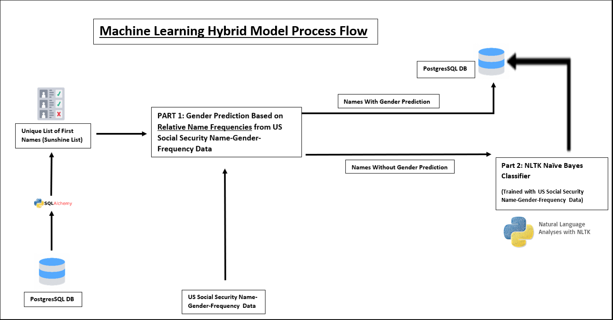
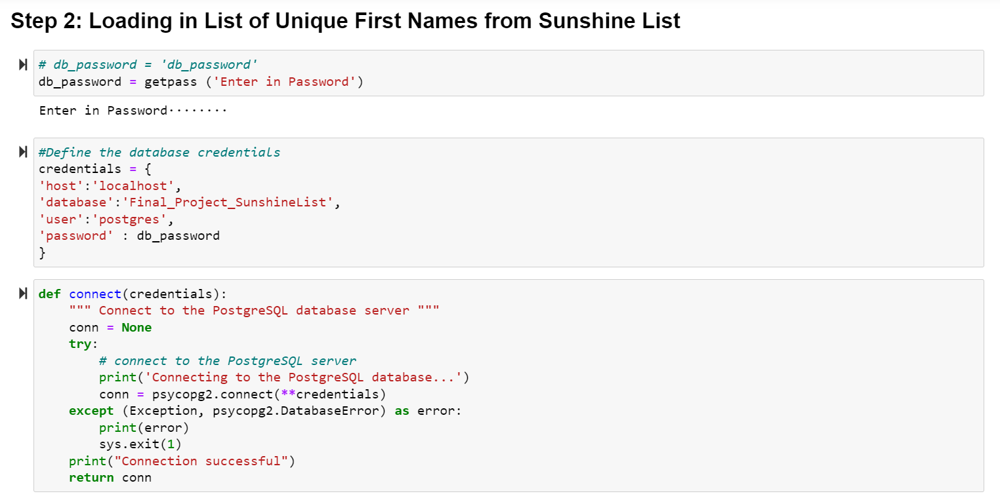
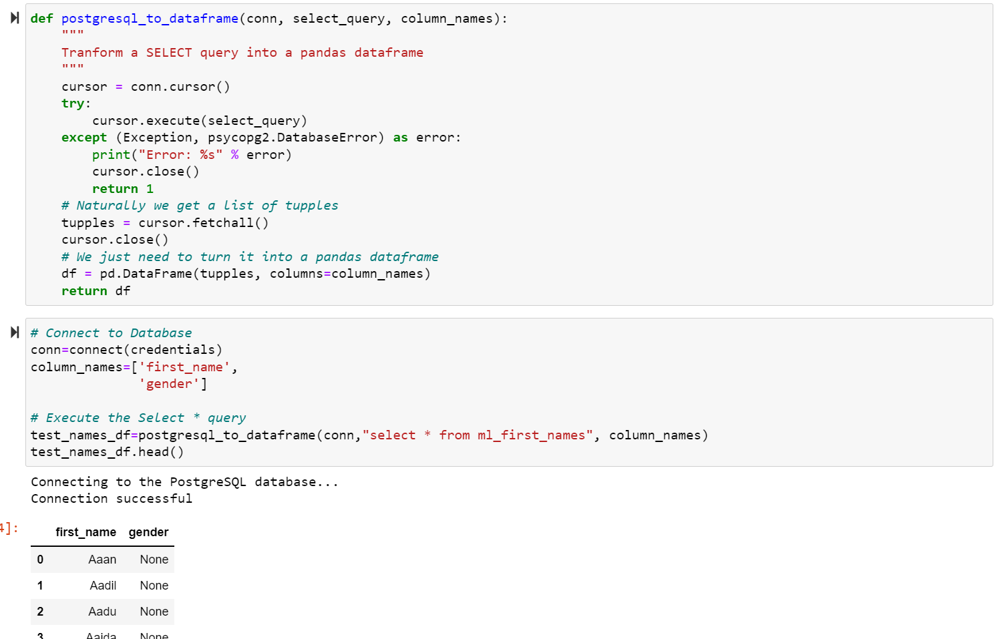
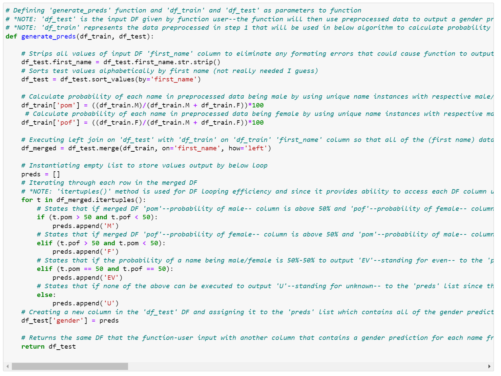
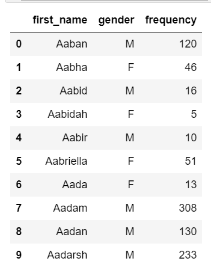
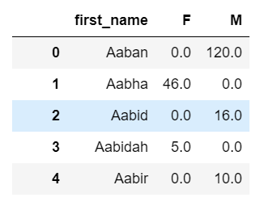

# Machine Learning (ML) README
---
## How ML Model Ties into Project
* The Sunshine List data has never included associated gender data. Having the gender of each person/record from the Sunshine List will play a very critical role in answering our primary research question: "Can the Sunshine List be used to evaluate **fairness** in Ontario's workforce", which is exactly what our ML model sets out to do.
* The model will grant access to unprecedented insights from Ontario's public sector workforce by supplying our Postgres SQL database with a gender prediction for each Sunshine List record.
* The model exists in a Jupyter Notebook Python file to intake a unique list of first names from all of our Sunshine List records (taken directly from our database via SQLAlchemy) and output a respective gender prediction for each one.
* The model's gender predictions play a very important part in our project by supplying it with a new feature that will likely strengthen the signifcance of our insights to be uncovered through our analysis and better help us answer our primary research question. 
* To expand, the Sunshine List data comes with the following features for each person/record: year, sector, employer, job title, last name, first name, salary paid, and taxable benefits. 
* Moreover, the model adds to this by giving us gender, which can then be used to query the Sunshine List to reveal trends and create exciting graphs such as a gender-salary breakdown for certain industry(ies)/job title(s)/year(s), etc. which will likely strengthen our ability to accurately answer our primary research question. 

---
## Machine Learning Hybrid Model Process Flow Diagram

---
## 1. How does it work?
Step 1: Preprocessing U.S. Social Security Name-Gender-Frequency Data
  * The U.S. Social Security website has made a list of file free for public access
  * There is one file per year dating back to 1880
  * Each one is a txt file that contains a list of names, that name's respective gender, and that name-gender's frequency for that given year, as seen below:

  * Every name-gender combination is unique, meaning the same name can be listed twice but only if each instance possesses a different gender (one male, one female)
  * The frequency data represents the number of people in the US that possessed this respective name-gender combination in a given year
  * Every year a new file is released in the same format however, the data is updated based on births/deaths of people with that specific name-gender combination
  * For a name-gender combination to be included in the file, it must have at least 5 people in the U.S. that fall under it

Step 2: Loading in List of Unique First Names from Sunshine List
  * Using SQLAlchemy, connection is established to a local postgresSQL database containing a table with all of the unique first names extracted from our Ontario Sunshine List table
  * See below for screenshots of the SQLAlchemy code:

Step 3: Creation of Relative Name Frequency (RNF) Function
  * New function is defined called 'generate_preds' 
  * Function takes two inputs: 'df_train', and 'df_test'
  * The function will then use the quantitative name-gender-frequency data contained in the 'test_df' to perform a simple conditional probability calculation used to output a gender prediction
  * If the probability of the name being male is over 50%, the function will assign an 'M' prediction, and vice versa
  * If the function cannot find a name from 'df_test' it will not be able to calculate a probability and thereby will not be able to output a gender prediction
  * In this case, the function will output a "U" value, which stands for "unknown"
  * In the rare occurrence that a name has an equal probability of being male and female, the function will output an "EV" value, which stands for "even probability"
  * Once the function has outputted a gender prediction for every name it can from the 'test_df' input parameter, it will output the results in a DF with two columns: 'first_name' which includes all of the first names passed via the 'df_test' parameter, and a 'gender' column, storing all of its target variable (gender) predictions

Step 4: NLTK Naive Bayes Classification Model (NBCM)
  * Once the NLTK NBCM is instantiated, and trained with the same US Social Security Data, all of the resulting "U" and "EV" predictions generated by the RNF function are passed through the NLTK NBCM so that a male/female gender prediction is assigned to every name from the 'test_df' parameter passed to the RNF function

Step 5: Concatentation 
  * The NLTK NBCM predictions are concatenated with the RNF function's output to create a new DF that holds a legitimate gender prediction for every unique first name from Ontario's Sunshine List 

Step 6: Back to the DataBase
  * Finally, the final dataframe containing all of the unique first names from Ontario's Sunshine List and their associated gender predictions is inserted into the local PostgresSQL database as a new table which can then be joined with the Sunshine List table on the first name column via SQL so that a gender prediction is now associated with every person from our Ontario Sunshine List spanning 1996-2020
---

## Description of Data Preprocessing - RNF Function
* Downloaded US Social Security name-gender-frequency data onto local machine (1 file per year from 1880-2020)
* Looped through each file in a Python Jupyter Notebook to read each one into a Pandas (PD) DataFrame (DF) using the OS library
* Used a functools library function called 'reduce' and passed to it a lambda function that appends each individual DF into one large DF
* A PD DF groupby method was then performed on the large DF's 'first_name' and 'gender' columns and the frequencies were summed
 - Resulting in only the unique name-gender instances remaining in the DF
* The large DF was then split into two separate DFs:
 - One including all of the multi-gender first names
 - Another for all non multi-gender first names
* Pivot function was also used on each of the two DFs mentioned just above for the purpose of removing the 'gender' column and replacing it with two new columns: 'F', and 'M'
 - For example, instead of having two different instances, one for: 'first_name': 'Avery', 'gender': 'M', 'frequency': 800 and another for 'first_name': 'Avery', 'gender': 'F', 'frequency': 1200
 - There would now be one row instance with the following data: 'first_name': 'Avery', 'F': 1200, 'M': 800
 - Where the 'F' and 'M' columns each present the respective gender-frequency of any given first name
* Once this was done, the two DFs, one containing all multi-gender first names and the other containing all uni-gender first names, these two DFs were appended to create the variable, 'final_best_df', representing the final format of the US Social Security name-gender-frequency data to be used in our project
Before Pivot:

After Pivot:

## Description of Data Preprocessing - Naive Bayes Classification Model
* The preliminary processing for the NLTK Naive Bayes Classifier began with preprocessing our raw training data to be used to train the model
* The raw training data selected was the large DF consisting of all the US Social Security data's unique name-gender instances 
* The only difference between this and 'final_best_df' is that the pivots had not been performed yet 
 - The reason for this discrepancy is explained within the 'ML_Model_Evaluation' Jupyter Notebook file
* Then, a function was defined and used to do the following:
 - Slice the first_names to leave only the last three letters of each
 - Store each in a dictionary with the key: 'last three letters' and the value being the last three letters of each first name
* Next a list comprehension was used to perform this function on each unique name-gender instance from the raw training data
* Further, the list comprehension was defined to store each of the function's outputs (dictionary) within a list of respective tuples
* Lastly, the list comprehension was instructed to draw on the 'gender' column which contained the target variable (gender) for each unique name-gender instance and added this value to the tuple, but outside of the dictionary
* The result was supervised data taking on a list of tuples structure satisfying all of the NLTK library-Naive Bayes Classification Model preprocessing requirements, thereby ready to be passed to an NLTK Naive Bayes Classification Model instance and used to train it

---

## Description of Feature Engineering and the Feature Selection, Including the Decision Making Process
* The only feature considered for use in performing our gender predictions was first name due to plausible relevance in predicting a person's gender and suggestions discovered from thorough research
* However, the original preprocessing method for the NLTK Naive Bayes Classification Model used only the last letter of each first name and its respective target variable (gender), but after testing out the possibility of using only the last letter, the last two letters, the last three letters, and even the entire name, it was decided that using the last three letters as the lone input feature was optimal because it resulted in the highest accuracy score without an accompanying fear of overfitting

---

## Description of Training, Testing, and Evaluation Process
* Note: 'actual model' is used as a reference to our actual Hybrid ML Model Jupyter file used to perform its desired task in line with our project
* Evaluating the accuracy of the hybrid model as a whole posed a challenge because the RNF function (first component of the hybrid model) operates by drawing on the data it is given to work with and performing the relevant conditional probability calculation to determine if a name is more liklely female or male
 - As discussed above, the RNF function takes two parameters as inputs: train_df, and test_df where the 'train_df' ('final_best_df' for our project) is a DF containing three columns: 'first_name', 'F', and 'M'
 - Moreover, 'M' and 'F' contain an integer that represent a male frequency and a female frequency of the given name, respectively, which serves as the quantitative input for the conditional probability calculations
 - If a name only has either male or female frequencies, one of the columns will simply possess a 0 that would be used in the calculation and thereby, the RNF function's prediction would be either M/F with a resulting 100% probability from its POV (percentages not displayed in model)
* As you may have anticipated already, the RNF function is therefore not able to output a prediction for any first name belonging to the 'df_test' input (the list of test first names for which RNF model is outputting a gender prediction) that it does not have stored in its 'df_train' input
* So, the RNF function was instructed to output a "U", standing for unknown, anytime it was presented with a first name that was not stored in its frame of reference ('df_train' parameter)
* The problem this presents is that one cannot just split the data up using the standard sklearn train_test_split method because the function would not be able to output a prediction for any name it does not have access to gender-frequency data for
* The solution executed (and can be seen via our 'ML_Model_Evaluation' Jupyter Notebook file) was brainstormed in the context of creating an evaluation/testing process that most resembles the way that the data flows through our actual model, the only difference is that instead of using the Ontario Sunshine List of unique first names to output a gender prediction for, supervised/labeled data was used in its place for accuracy evaluation purposes
 - First, since the frame of reference ('df_train' parameter) used by the RNF function is all of the US Social Security name-gender-frequency data, the RNF function was fed the same data in our testing file
 - Second, the RNF function was passed a unique list of 7,943 first names derived from the NLTK library (this list of first names and their associated genders came with installation of this library as supervised testing data) 
 - Third, the actual genders of these 7,943 first names were added to the DF outputted by the RNF function (so now the outputted DF contains: first names, RNF function gender predictions, actual genders (supervised tagret variable)
 - Fourth, a multi-conditional for loop was used to add an "Evaluation" column to this DF which would display whether or not the RNF function correctly predicted the gender of each first name by identifying where the 'Actual' (supervised target variable) and 'RNF_gender' (RNF function's gender predictions) columns had matching values and where they did not, subsequently assigning a value of "C" for correct, and "I" for incorrect
 - After executing a value_counts method on this column, it was determined that the RNF function correctly predicted the genders of 6292/7943 of the first names passed
 - Therefore, giving the RNF function an accuracy score of approx. 79.20% when used on its own
 - Now, at this point in our actual ML model, all of the first names that are given a "U" (unknown) or "EV" (even probability, meaning this first name has an even number of male/female frequencies throughout US Social Security data history) prediction from the RNF function are then extracted and passed to the NLTK Naive Bayes Classification Model (NBCM)
  - This is done to ensure that every first name passed to our ML model receives a binary M/F gender prediction (since the RNF function can only predict genders for the names is has gender-frequency data on)
 - Further, in our actual ML model, before these select first names are passed to the NLTK NBCM, the NBCM is trained using the appropriately preprocessed US Social Security Data, therefore the same is done here in our 'ML_Model_Evaluation' file
  - A slight caveat was realized at this point in the constructing of our 'ML_Model_Evaluation' file, this being that the "Evaluation" column used above to gauge the accuracy of the RNF function's predictions was derived by actually evaluating whether or not the RNF function's predictions were correct
  - The issue being that in our actual ML Model, we do not have the luxury of knowing whether or not the RNF function CORRECTLY predicted any given first name's gender from the Ontario Sunshine List, we only know whether or not the function was able to output a prediction or not because the Ontario Sunshine List does not have a gender column (purpose of our whole ML model is to generate gender predictions for this unsupervised data to be used along with the other columns of the Ontario Sunshine List in a myriad of fascinating analyses)
  - But the RNF 'Evaluation' column discussed above (only included in ML_Model_Testing file of course) did indeed only denote a "C" (correct) to the first names that the RNF function CORRECTLY predicted, and an "I" (incorrect") to all of the names that received an incorrect prediction, received a "U" prediction, or those that received an "EV" prediction
  - This differs from the actual model because in the actual model, all first names that received a gender prediction of F/M were assigned a "C" just to identify that the RNF function was able to successfully output a prediction for a given name by referencing its 'df_train' input data, while those that received either a "U" or an "EV" were assigned an "I" for incorrect, which is suffice to ensure our model accomplishes its goal of predicting a gender for every first name passed because in the real model, only the names with a "U" or "EV" are passed to the NLTK NBCM since all the other ones already have a gender prediction from the RNF function
 - Thereby, when it came time to pass the appropriate names to the NLTK NBCM in our 'ML_Model_Evaluation' file, we could not just extract and pass all of the instances with an "I" because they additionally included all of the incorrect RNF predictions, but nonetheless, predictions, so if we did this, our evaluation process would veer from our actual process and therefore make our evaluation results less credible
 - So, it was decided that we needed a better way to classify the RNF function's results that would allow us to label the data we wanted to be passed to the NLTK NBCM (as per the actual ML model):
 - Using another multi-conditional for loop we were able to classify each RNF prediction as either:
  - 1. "RNF-Correct" meaning the RNF function predicted the name correctly
  - 2. "RNF-Incorrect" meaning the RNF function was able to output a prediction but it was incorrect
  - 3. "RNF-Unknown" meaning the RNF function was not able to output a prediction due to insufficient data
  - 4. "RNF-EV" meaning the RNF function was not able to output a prediction due to even probability;insufficient data
* These results were then added as a column to the DF 
* From there, another multi-conditional for loop was used to only extract the "RNF-Unknown" and "RNF-EV" instances (the desired instances for which we want to use the NLTK NBCM gender predictions when creating our final hybrid model gender predictions, in line with the actual model process)
* For the purposes of the 'ML_Model_Evaluation' file, all 7,943 of the supervised first name data used for testing and later accuracy evaluation were fed through the NLTK NBCM after the NLTK NBCM was trained using the supervised US Social Security unique name-gender-frequency data and all of these predictions were appended as a row to this DF as well so that
* So now that we have all of this data side-by-side in one DF, another multi-conditional for loop was used to compare the improved RNF evaluation column to the actual gender data
* Using this for loop, if the RNF prediction was correct or incorrect, it was appended to a new list variable as is (what would have happened in actual model)
* Further, if the RNF prediction was "U" or "EV", the NLTK gender prediction for this name was appended to this new list
* This new list of hybrid gender predictions was then appended as a row to the DF referenced above and subsequently compared to the actual gender data (also in the DF) and the final hybrid model's gender predictions were evaluated against the actual gender data to determine an accuracy score of approx. 89.53%, an approx. 10% accuracy increase from the RNF function alone!

---

## Explanation of Model Choice Including Limitations and Benefits
* Custom hybrid model was selected
#### Limitations
* Firstly, the model is limited on the basis of using the unique name-gender-frequency data from the records of the US Social Security office. 
* This is a limitation since ultimately, both components of the hybrid model (RNF Function and NLTK NBCM) are individually trained using this data, rather than the equivalent Canadian historical data, to predict the genders of people from the Ontario Sunshine List. 
* It follows that Canada is known to be more multi-cultural than its neighbour to the South as evidenced by its historical, consistently greater intake of immigrants
* Therefore, our model's accuracy could be hindered by not possessing data on such foreign names that are likely more prevalent in Canadian society than the US
* Secondly, since the NLTK NBCM operates on dissecting its training data into n-grams a discussed above, the model could be limited on the grounds that the training data used for the NLTK NBCM was a list (derived from US Social Security data) consisting of all unique name-gender combinations. For context, the logic behind the NLTK NBCM n-gram breakdown/analysis dictates that it tracks the frequency of each n-gram belonging to each gender, and then uses these as the quantitative inputs to perform a conditional probability equation that ultimately determines its prediction. Circling back, the training data fed to the NLTK NBCM is a unique list, therefore it does not take freuqency of each name-gender combination into account. Logically, it could follow that by expanding the list to store an instance for each frequency occurence, the model would have more data that could increase its accuracy when predicting multi-gender first names.
* However, admittedly, more thought is needed to determine how this change could effect the NLTK NBCM model's output for uni-gender first names and overall output, as well as the overall hybrid model's output
#### Benefits
* One benefit of using this hybrid model is that the presence of the RNF function decreases the total computing power necessary for the NLTK NBCM since there is a signficantly less number of names being passed to it for a gender prediction
* The primary benefit of using the hybrid model opposed to solely the RNF function or solely the NLTK NBCM is twofold:
 - 1. Adding the NLTK NBCM to the model's process ensures that a gender prediction will be generated for each and every name
 - 2. As displayed through our, 'ML_Model_Evaluation' Jupyter Notebook file, the RNF function alone generated an accuracy score of approximately 79.20%, while the NLTK NBCM was not far off at approximately 80.22%
 - 2. (cont.) However, when these two individual components are used together with a systematic filtering process, their combined accuracy increases approximately 10%.